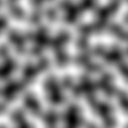
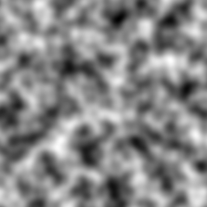
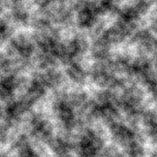
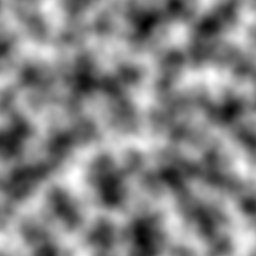
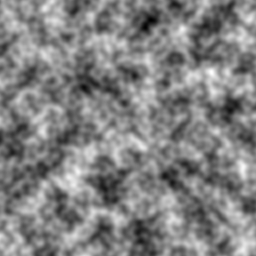

# Minimalist Perlin Noise Implementation

This repository contains a minimalist single-file implementation of Perlin Noise in Python.

## Usage

You can use the `noise` function to generate simple Perlin Noise. The input should be the coordinates of the point you want to calculate the noise value for, and the output will be the resulting noise value.

To generate fractal Perlin Noise, use the `perlin` function, which is built on top of `noise` and takes three additional parameters to control the fractal parameters.

To obtain a grid of values, you can use the `give_grid` function, which is based on the `perlin` function. This function returns an `NxN` grid of fractal Perlin Noise values.

Dependencies: NumPy.

## Results

### Varying octaves

<div style="display:flex; justify-content:center; align-items:center;">
  <figure>
    
    <figcaption style="text-align:center;">octaves=1</figcaption>
  </figure>
  <figure>
    
    <figcaption style="text-align:center;">octavas=2</figcaption>
  </figure>
  <figure>
    
    <figcaption style="text-align:center;">octavas=3</figcaption>
  </figure>
</div>


### Varying frequency

<div style="display:flex; justify-content:center; align-items:center;">
  <figure>
    
    <figcaption style="text-align:center;">frequency=1</figcaption>
  </figure>
  <figure>
    
    <figcaption style="text-align:center;">frequency=2</figcaption>
  </figure>
  <figure>
    
    <figcaption style="text-align:center;">frequency=3</figcaption>
  </figure>
</div>

### Varying persistence

<div style="display:flex; justify-content:center; align-items:center;">
  <figure>
    
    <figcaption style="text-align:center;">persistence=0.25</figcaption>
  </figure>
  <figure>
    
    <figcaption style="text-align:center;">persistence=0.50</figcaption>
  </figure>
  <figure>
    
    <figcaption style="text-align:center;">persistence=0.75</figcaption>
  </figure>
</div>

## BibTeX

```
@inbook{10.1145/3571600.3571657
  author = {Jain, Aryamaan and Sharma, Avinash and Rajan, K S},
  title = {Adaptive &amp; Multi-Resolution Procedural Infinite Terrain Generation with Diffusion Models and Perlin Noise},
  year = {2022},
  isbn = {9781450398220},
  publisher = {Association for Computing Machinery},
  address = {New York, NY, USA},
  url = {https://doi.org/10.1145/3571600.3571657},
  booktitle = {Proceedings of the Thirteenth Indian Conference on Computer Vision, Graphics and Image Processing (ICVGIP'22), December 8--10, 2022, Gandhinagar, India},
  articleno = {57},
  numpages = {9}
}
```

